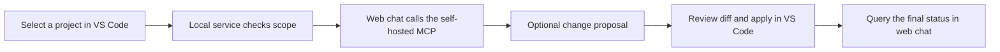

# AI Zhagan

AI Zhagan lets an MCP-capable web assistant read only the local projects you explicitly authorize. The core service runs separately from the editor; the first adapter is for VS Code. The code is MIT licensed.

**Current status: local 0.3.0 candidate.** The Windows x64 VSIX bundles the runtime and provides a VS Code home page for installation, folder selection, project authorization, and connection status. Public distribution, a complete live ChatGPT round trip, clean-machine upgrade, and long-running stability gates remain open. See the [compatibility matrix](docs/compatibility.md) and [v1 release review](docs/acceptance/v1.md). No public release or marketplace listing has been made.



Proposing a change creates a **pending review** item and does not edit files. In VS Code, choose it from the pending list or paste its ID, inspect the diff, and apply explicitly in a clean, connected workspace. The web chat must query the change status again to see the result. There is no remote direct-write or arbitrary-command tool.

## Start locally on Windows

For source setup on Windows 11 x64, use Python 3.11 or newer, Node.js for the extension build, and Git for Git features. A built runtime and VSIX do not require Python or Node on the user's machine, but clean-machine installation is still an open release gate. From this repository:

```powershell
powershell -NoProfile -ExecutionPolicy Bypass -File .\scripts\setup.ps1
powershell -NoProfile -ExecutionPolicy Bypass -File .\scripts\start.ps1
powershell -NoProfile -ExecutionPolicy Bypass -File .\scripts\token.ps1
```

Open `http://127.0.0.1:8766` and enter the local management token printed by the last command. Do not paste that token into a chat. It is held in page memory and cleared on reload. The service listens on loopback by default.

For everyday use, follow the [three-step guide (Chinese)](docs/quickstart.md): select a project, connect, and ask a verification question. Open the project folder in VS Code and run `AI Zhagan: 开始或继续三步向导` (“Start or resume three-step guide”) from the Command Palette. The extension can pair with a managed runtime without copying a long-lived token; it stores the credential in VS Code SecretStorage. Unsaved editor content is not shared unless enabled separately for that project.

Connecting ChatGPT requires your own fixed HTTPS MCP endpoint, GitHub OAuth configuration, an allowed account, and a chat account that can add an MCP connection. Starting the local service does not prove that the web account can call it. Use `verify_connection` from the chat and then read an actual file. The offline demo uses fixed sample data and is clearly labeled as disconnected.

## Project and write boundaries

Projects start in read-only mode. Changing a project to “allow proposals” only lets the assistant create a pending change. Local apply is a separate permission and action. The extension shows the file diff and asks the service for a short editor-readiness lease; dirty, disconnected, stale, or conflicting files block the write. After application, run your project's tests. A later file change can block undo, in which case inspect the recovery state rather than overwriting it.

The assistant receives only the content returned through the authorized MCP tools. This is not local model inference. The service does not upload telemetry. Diagnostic export is user initiated and omits paths, tokens, source content, OAuth responses, and identity details by default; preview the export first.

## Development and support

Run `scripts/self-test.ps1`, `npm run test:e2e`, and `npm --prefix extensions/vscode run test:integration`. The core test suite does not require an external account. See [architecture](docs/architecture.md), [troubleshooting](docs/troubleshooting.md), [data and privacy](docs/privacy.md), [contributing](CONTRIBUTING.md), [security reporting](SECURITY.md), [release process](docs/releasing.md), and the [change log](CHANGELOG.md).
