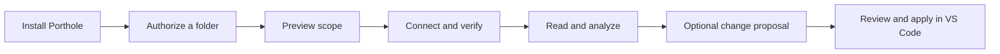

# Porthole · 舷窗

**Connect your AI assistant to local folders you authorize.**

Porthole is a local, open-source MCP tool. Select a folder and let an MCP-capable assistant read code, documents, and tables. Changes are proposed first, then reviewed and explicitly applied in VS Code.

[中文](README.md) · [Download v0.9.0](https://github.com/sky910140/porthole/releases/tag/v0.9.0) · [Beginner manual (Chinese)](docs/beginner-manual.md) · [Documentation](docs/README.md)

**Status: 0.9.0 prerelease, MIT licensed.** The primary target is Windows x64 with VS Code. Clean Windows VM installation, 24-hour stability, and a complete live ChatGPT private-tunnel round trip remain open acceptance items. See the [compatibility matrix](docs/compatibility.md). The extension is not listed on the marketplace and the binaries are unsigned.

## Install and connect

Using the bundled Windows VSIX does not require Python, Node.js, or terminal commands.

1. Download `porthole-0.9.0.vsix` from the [release page](https://github.com/sky910140/porthole/releases/tag/v0.9.0).
2. In VS Code, choose **Extensions → … → Install from VSIX**, then reload when prompted.
3. Run **舷窗: 打开首页** from the Command Palette and install the local service.
4. Select a folder, confirm authorization, and preview the accessible files.
5. Open the recommended ChatGPT connection wizard. Supply a Tunnel ID and runtime API key, then add the matching tunnel app in ChatGPT.
6. Select that app in a conversation and send the wizard's verification prompt. Start using it after a real tool call confirms the connection.

The recommended route uses OpenAI Secure MCP Tunnels and requires the relevant Platform and ChatGPT permissions. It removes the need for a domain and a GitHub OAuth App, but cannot create account permissions for you. Follow the [beginner manual](docs/beginner-manual.md) for form fields and permission requirements.

Keep VS Code, your computer, and the network running. A healthy local service or tunnel does not prove that ChatGPT can call your tools.



## Features and limits

- Folder authorization, friendly project names, pause/revoke controls, and scope previews.
- Bounded directory listing, text reading, literal search, Git status, and diffs.
- Bounded UTF-8 CSV and XLSX reading through `read_table`; formulas are not calculated.
- Optional sharing of editor text, selection, and diagnostics; unsaved content is disabled by default.
- Local review and explicit application of change proposals, with conflict checks and recovery records.
- Resumable setup, connection checks, redacted diagnostics, upgrade rollback, and initial-state reset.

PDFs, images, and legacy XLS are not parsed. Claude web, macOS, Linux, WSL, Remote SSH, and Dev Containers are outside the initial support commitment.

## Data and permission boundaries

Projects start read-only. Only authorized content returned by MCP tools reaches the selected AI service; this is not local model inference. There is no remote direct-apply or arbitrary-command tool. Local apply requires separate permission, diff review, and clean editor/file checks. Run your project's tests after applying changes.

The management API is loopback-only and separate from MCP. Never expose management port `8766` through a public tunnel. The tool has no automatic telemetry. User-initiated diagnostic exports omit source content, credentials, identity, and local paths by default. See [privacy](docs/privacy.md), [architecture](docs/architecture.md), and [security reporting](SECURITY.md).

## Develop on Windows

Source development requires Python 3.11+, Node.js 22+, and Git:

```powershell
git clone https://github.com/sky910140/porthole.git
cd porthole
python -m venv .venv
.\.venv\Scripts\python.exe -m pip install -r requirements-windows.lock
.\.venv\Scripts\python.exe -m pip install -e . --no-deps
npm ci
npm --prefix extensions/vscode ci
npx playwright install chromium --only-shell
powershell -NoProfile -File .\scripts\self-test.ps1
```

See [contributing](CONTRIBUTING.md) for integration/browser checks and [release instructions](docs/releasing.md) for packaging. Automated local tests use isolated fixtures and do not require a live AI account.

## Feedback and license

Use [Issues](https://github.com/sky910140/porthole/issues) for bugs and feature requests. Report security problems through the [private security channel](SECURITY.md), without disclosing credentials or private files.

Porthole is [MIT licensed](LICENSE). Bundled dependencies retain their own licenses; see [third-party notices](THIRD_PARTY_NOTICES.md).
