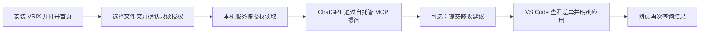

# AI Zhagan

让支持 MCP 的 AI 对话按需读取经过明确授权的本机项目。核心服务独立于 IDE，首个正式适配器为 VS Code。

项目以 MIT 许可证开源。当前源码版本为 **0.3.0 本地候选版**：VSIX 内置 Windows x64 运行包，VS Code 首页可选目录、管理授权并查看连接状态；公开分发、真实网页闭环和稳定升级尚未通过发布验收。[英文说明](README.en.md) · [兼容性](docs/compatibility.md) · [v1 发布评审](docs/acceptance/v1.md)

当前提供项目目录、固定字符串搜索、分段读取、Git 状态和 diff、明确授权的编辑器上下文、修改建议及本机审阅应用、独立管理页面。没有模型 API 调用，也没有远程直接写文件或任意执行命令工具。



修改建议首先是“待审阅”；只有在 VS Code 明确应用后才改变磁盘。应用后仍需运行项目自己的测试。首次使用见 [三步快速开始](docs/quickstart.md)，故障处理见 [排查指南](docs/troubleshooting.md)，数据范围见 [隐私说明](docs/privacy.md)。

**当前验收范围是本地开发和已有连接的实际文件读取。** 把本地服务运行起来，不代表网页账号已经接通；当前连接状态必须通过一次真实工具调用验证。自托管网页连接仍需要受支持的 HTTPS 入口、身份配置和相应账号权限。

## 快速开始（Windows）

安装 `extensions/vscode/ai-zhagan-context-0.3.0.vsix` 后，在 VS Code 运行 `AI Zhagan: 打开首页`，点击“安装本机服务”，再点击“选择文件夹”并确认只读授权。无需 PowerShell、Python 或 Node。界面可切换项目、暂停或移除授权，并预览可访问文件数量。完整步骤见 [三步快速开始](docs/quickstart.md)。

以下命令仅用于源码开发和手动服务管理。

需要 Python 3.11+；Git 功能还需要 Git。在本项目目录执行：

```powershell
powershell -NoProfile -ExecutionPolicy Bypass -File .\scripts\setup.ps1
powershell -NoProfile -ExecutionPolicy Bypass -File .\scripts\start.ps1
powershell -NoProfile -ExecutionPolicy Bypass -File .\scripts\token.ps1
```

最后一条命令在自己的终端显示本机管理令牌。打开 `http://127.0.0.1:8766`，粘贴令牌连接。不要把令牌贴到 AI 对话中。页面只在内存保存令牌，刷新后清除。

首次默认登记本项目，标识为 `current`。也可以在首次 setup 时传 `-ProjectPath 'D:\workspace\my-project' -ProjectId backend`；现有配置不会被覆盖。已经初始化的环境以管理页面显示的实际项目标识为准，可在页面添加或移除授权项目。

```powershell
.\scripts\status.ps1
.\scripts\stop.ps1
```

启停命令只控制本配置对应的服务，端口冲突会报错，不会杀死其他进程。服务默认只监听回环地址；关闭管理页面不会停止服务。

## VS Code 扩展

在“扩展 → … → 从 VSIX 安装”选择 `extensions/vscode/ai-zhagan-context-0.3.0.vsix`。

1. 运行 `AI Zhagan: 打开首页`，安装内置运行包并通过系统目录选择器授权文件夹；原“三步向导”命令也会打开首页。
2. 首页自动完成受管理服务配对，不需复制管理令牌。选择别的目录会创建独立授权，不沿用旧目录的修改权限；沿用手动服务时执行 `AI Zhagan: 配置连接`。
3. 如需分享未保存内容，先在本机管理页为该项目开启“共享未保存内容”，再执行 `AI Zhagan: 发布当前编辑上下文`。令牌存入 VS Code SecretStorage。
4. 执行 `AI Zhagan: 打开 ChatGPT / Claude`，使用 VS Code 集成浏览器；第三方登录需实际验证。
5. 首页显示本机服务、公网通道、账号授权和真实工具调用四层状态。自动同步默认关闭，需要时在工作区启用 `aiZhagan.autoSync`。

网页返回修改编号后，在 VS Code 运行 `AI Zhagan: 查看修改建议`，从待审阅列表选择；列表未显示时仍可粘贴编号。逐文件检查差异，再运行 `AI Zhagan: 应用已审阅修改`。应用要求项目已开启本机应用、相关 VS Code 窗口在线且没有未保存内容，并使用最多 5 秒的一次性就绪租约。应用后仍需由用户运行项目测试。

磁盘工具读取已保存内容。未保存内容默认不共享；明确开启后，`get_editor_context` 才能读取插件发布的内存快照。快照 15 分钟后失效。模型必须显式使用项目标识和会话标识，不能自动猜选另一窗口。

每个项目默认使用“仅查看代码”模式，也可以在 VS Code 首页切换为“允许提出修改”。后者只开放创建待审阅修改单的能力，不等于允许写入；本机应用授权单独管理。暂停项目会立即撤销文件、Git 和编辑器上下文访问。

插件详细设置和测试见 [扩展说明](extensions/vscode/README.md)。其他 IDE 可以实现相同本地接口，详见 [适配协议](docs/adapter-api.md)。

当前验证组合和未通过门禁见 [兼容性表](docs/compatibility.md)。

## MCP 工具

| 工具 | 功能 |
|---|---|
| list_projects / workspace_info | 项目标识、访问模式、Git 分支和提交信息 |
| list_files | 分页列出允许访问的文件，区分下一页与扫描预算耗尽 |
| search_code | 有界固定字符串搜索，附文件和行号 |
| read_file | 按行读取，附 SHA-256 和修改时间 |
| read_files | 一次读取最多 10 个文件，各条目独立返回范围错误 |
| preview_scope | 预览可访问文件数量、排除原因和扫描完整性 |
| git_status / git_diff | 允许路径内的保存后变更 |
| list_editor_sessions | 已发布且未过期的编辑器会话 |
| get_editor_context | 指定会话的文本、选区及诊断 |
| verify_connection | 用本机生成的限时挑战执行一次真实读取，确认网页工具链可用 |
| propose_changes | 在“允许提出修改”模式下创建待本机审阅的修改单，不改文件 |
| get_change_status | 按修改编号查询状态、revision 和文件摘要 |
| get_change_diff | 查看受大小限制的保存内容与提案内容差异 |

读取结果有大小、时间和数量限制。`has_more` 与 `next_offset` 表示可以继续翻页；`truncation_reason=scan_limit` 表示扫描预算耗尽，应缩小目录，不能视为已扫描完整项目。非 UTF-8 文件和二进制文件不提供文本读取。代码片段通过 MCP 返回后会被对应 AI 服务处理，不是完全本地推理。

管理页和 `project-assistant doctor` 分开显示本机服务、公网通道、OAuth 和真实工具调用四层状态。启动成功只代表本机服务可用；只有本机生成挑战后，由已认证 AI 客户端调用 `verify_connection` 并完成项目读取，真实工具调用层才会显示正常。状态会过期，不能用历史成功代替当前连接。

## 本地 MCP 客户端

MCP 地址为 `http://127.0.0.1:8765/mcp`，需要 **独立的 MCP 令牌**，不能使用管理令牌。仅在本机测试客户端中使用：

```powershell
.\scripts\token.ps1 -Kind mcp
```

本地令牌模式不配置给公网网页。服务没有匿名文件读取接口，也不会把管理接口放到 MCP 端口。

## 以后连接官方网页

1. 准备域名和 Cloudflare 命名 Tunnel，固定主机名只映射 `127.0.0.1:8765`；**不要映射管理端口 8766**。
2. 创建 GitHub OAuth App，回调 URL 为 `https://你的域名/auth/callback`。
3. 停止服务，编辑 `config/local.json`：`auth_mode` 设为 `github`，填写 HTTPS `public_url` 和仅含本人数字用户 ID 的 `github_user_ids`。
4. 在启动进程环境中设置 `PROJECT_MCP_GITHUB_CLIENT_ID`、`PROJECT_MCP_GITHUB_CLIENT_SECRET`；不要将它们提交到源码。OAuth 持久化使用加密存储。
5. 执行 `.venv\Scripts\project-assistant.exe doctor` 检查配置，再启动服务。
6. ChatGPT Developer mode 和 Claude 自定义连接器分别添加 `https://你的域名/mcp`，完成各自授权。

`public_url` 与本地令牌模式不能共用，配置会拒绝启动。缺失 OAuth 参数也会拒绝启动。Cloudflare 客户端沿用其官方配置，本项目不会在缺少域名和凭据时自动建立隧道。ChatGPT 要维持普通 Chat 路径；MCP 不会把网页订阅转成任意 IDE 的原生模型 API。

## 自测与打包

```powershell
.\scripts\self-test.ps1
npm ci
npx playwright install chromium --only-shell
npm run test:e2e
cd extensions\vscode
npm ci
npm run test:integration
npm run package
```

Python 测试覆盖真实文件/Git、越界与秘密过滤、认证、MCP 客户端、真实 HTTP 服务启停。浏览器测试验证登录错误反馈、项目管理、文本安全、页面刷新后的凭据清除和移动布局。扩展测试运行在隔离的真实 Extension Host 中，不改变日常 VS Code 配置。

独立 Windows 运行包的构建、清单和无 Python/Node 路径黑盒验证见 [运行包说明](docs/runtime.md)。

本次结果与验收边界见 [自测报告](docs/self-test-report.md)。

依赖：Windows Python 锁文件为 `requirements-windows.lock`；两套 Node 工程均有 `package-lock.json`。不要在 macOS/Linux 上直接使用包含 Windows 专属依赖的锁文件；跨系统安装尚未验收。

源码尚未发布到插件市场或任何公网服务。修改单支持远程提交和查询，并可在 VS Code 明确审阅后本机应用、撤销或进入恢复流程。此能力限定为受管理的 VS Code 工作区；未接入协议的其他编辑器内存缓冲区无法检测。JetBrains 等其他 IDE 插件和任务执行属于后续功能。
