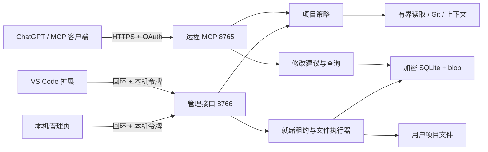

# 架构与信任边界

远程 MCP 只允许读取、提交建议和查询，不提供批准、应用、撤销或恢复操作。管理接口只监听 `127.0.0.1`，与 MCP 使用不同令牌；VS Code 配对后的令牌放在 SecretStorage。项目策略在所有读取路径和修改提交时共用，默认只读并排除工具状态目录。

修改单与操作编号写入 SQLite；文件内容和恢复备份加密后存入内容地址 blob。只有本机明确审阅且相关已登记 VS Code 会话在线、干净、租约未失效时，统一执行器才可能写项目文件。每步记录事务证据，中断后根据持久化状态恢复。未接入协议的其他编辑器内存缓冲区无法被观察；磁盘哈希复核能发现已经保存的外部变化，但不能提供跨进程文件事务。

扩展、管理页和 MCP 都只作适配；业务状态与安全规则在 `src/project_mcp/`。协议版本及生成契约见 `contracts/`，适配器接口见 [适配协议](adapter-api.md)。升级快照和候选打包见 [发布说明](releasing.md)。
