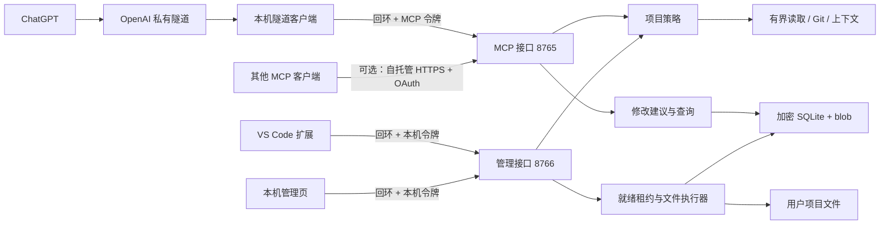
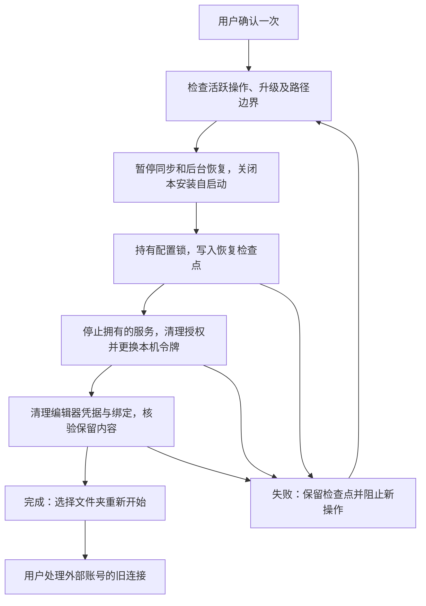

# 架构与信任边界

推荐连接通过官方私有隧道访问本机 MCP，不需要公网域名。运行 API Key 交给本机隧道客户端，ChatGPT 表单只填写 Tunnel ID；本机 MCP 仍校验独立令牌。自托管 HTTPS + OAuth 是可选的高级方式。

远程 MCP 只允许读取、提交建议和查询，不提供批准、应用、撤销或恢复操作。管理接口只监听 `127.0.0.1`，与 MCP 使用不同令牌；VS Code 配对后的令牌放在 SecretStorage。管理接口不经隧道或公网转发。项目策略在所有读取路径和修改提交时共用，默认只读并排除工具状态目录。

修改单与操作编号写入 SQLite；文件内容和恢复备份加密后存入内容地址 blob。只有本机明确审阅且相关已登记 VS Code 会话在线、干净、租约未失效时，统一执行器才可能写项目文件。每步记录事务证据，中断后根据持久化状态恢复。未接入协议的其他编辑器内存缓冲区无法被观察；磁盘哈希复核能发现已经保存的外部变化，但不能提供跨进程文件事务。

扩展、管理页和 MCP 都只作适配；业务状态与安全规则在 `src/project_mcp/`。协议版本及生成契约见 `contracts/`，适配器接口见 [适配协议](adapter-api.md)。升级快照和候选打包见 [发布说明](releasing.md)。

## 恢复初始状态

`reset.py` 管理本机事务；扩展管理自己的 SecretStorage、设置、进程与界面。配置编辑通过 `profile-lease` 持有跨进程锁，重置与旧窗口的配置回滚不能并发。检查点存在时，运行中的服务拒绝新操作，但允许状态查询、停止和重置续跑；准备握手失败也不会解除这项保护。

状态查询先检查安全条件，再瞬时探测配置锁，不在持锁期间检查文件或 SQLite。重置最多等待配置锁 0.5 秒，避免正常状态轮询引起误报；持续的编辑租约仍会阻止重置。真正清理前会再次检查活跃操作与不安全的修改状态。

配置相邻的回执记录恢复代次。窗口只有成功清理自身绑定后才确认回执；发起窗口完成后，其他已清理窗口解除暂停。升级快照必须匹配当前代次，不能恢复此前的授权。修改数据库、加密内容和恢复备份不属于清理范围；预检查可能创建协调锁文件，不修改项目、配置或历史内容。重置入口只提供本机 CLI 和回环管理接口，MCP 不提供重置工具。
