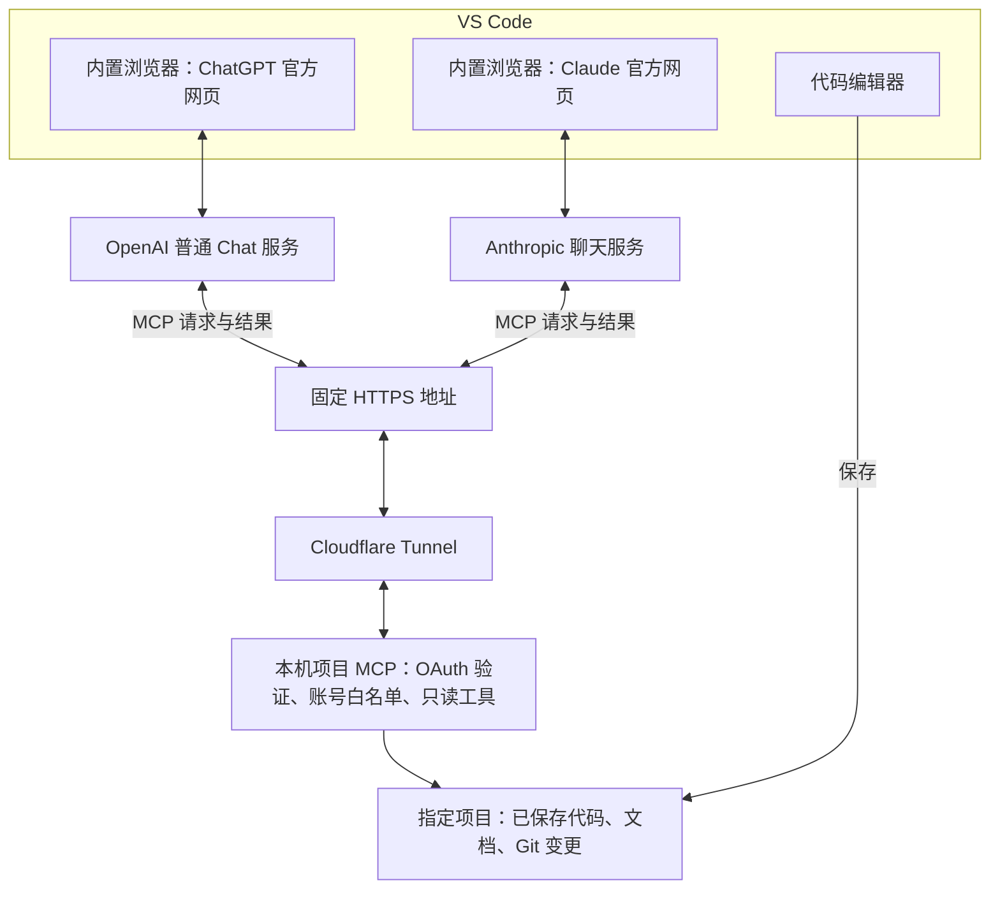

# 网页聊天与本地项目 MCP 实施方案（首个适配目标：VS Code）

日期：2026-09-18；实施更新：2026-09-19。状态：本地首版服务、管理页面和 VS Code 适配已实现；公网域名、OAuth 账号及官方网页登录验收尚未完成。下文保留原始分期设计，当前使用方式见项目 README，自测证据见 docs/self-test-report.md。

## 目标与推荐方案

在 VS Code 内置浏览器使用 ChatGPT 普通 Chat 和 Claude 官方网页；两者通过同一个经过 OAuth 验证的远程 MCP 地址，按需读取 Windows 上的当前项目。模型推理使用各自账号的订阅能力，项目 MCP 不调用模型 API。

这是一套需要搭建的小型集成，不是已经验证可安装即用的成品插件。聊天界面是 VS Code 中的网页标签；它不会成为 VS Code 原生 Chat 面板的模型提供方。

借鉴文章的“官方聊天 + MCP 获取上下文”方法，将数据源换成本地项目。自动执行开发任务可以另选 Claude Code，它与 Claude 网页共享订阅额度；第一版项目 MCP 保持只读。

## 前置条件与首次验证

- 已安装 VS Code 1.138.0；内置浏览器能力已有官方文档。此机器上的 ChatGPT / Claude 登录、SSO 和工具授权尚未实测。
- ChatGPT 账号具备 Developer mode 入口，所选聊天模型支持所需工具；当前文档列出 Plus、Pro、Business、Enterprise、Education。
- Claude 账号有自定义远程连接器入口；组织账号可能需要管理员添加。
- 一个 GitHub 账号，用于项目 MCP 身份认证，不需要为此开放仓库权限。
- 一个可用于 Cloudflare Tunnel 的固定域名和 Cloudflare 账号。没有现成域名时存在域名成本；不承诺所有基础设施都免费。
- 本机和网络在线时才能读取本地项目；被读取的代码片段会传给对应 AI 云端，不是完全本地推理。

## 架构



远程 MCP 请求由 AI 服务的云端发起。把网页打开在 VS Code 内，并不会使云端能够直接访问本机 localhost。

## 选型与实现边界

| 部分 | 选择 | 作用 |
|---|---|---|
| 聊天界面 | VS Code Integrated Browser | 保留官方登录、模型选择、聊天历史 |
| 项目 MCP | Python + PrefectHQ FastMCP | 提供 Streamable HTTP 工具接口 |
| 代码检索 | ripgrep + 分段文件读取 | 不引入向量库或付费嵌入 API |
| Git 上下文 | 固定参数的 Git 只读调用 | 展示分支、状态、暂存和未暂存 diff |
| 登录验证 | FastMCP GitHub OAuth + 服务端个人账号白名单 | 限制只有本人能够读项目 |
| 网络入口 | Cloudflare 命名 Tunnel + 固定域名 | 将云端请求转发到本机回环端口 |
| 日常启动 | PowerShell 启停脚本 + VS Code Task | 一次操作启动、检测和停止服务 |

MCP 监听 127.0.0.1:8765。示例外部地址为 https://project-mcp.example.com/mcp，example.com 必须换成实际域名。

## 实施顺序

### 1. 验证内置浏览器和账号入口

在 VS Code 命令面板执行 `Browser: Open Integrated Browser`，分别打开 https://chatgpt.com 与 https://claude.ai。使用本人账号完成登录。

可在用户设置中加入：

```json
{
  "workbench.browser.dataStorage": "global",
  "workbench.browser.newTabPlacement": "sideGroup"
}
```

确认两边均能发送普通对话，重启后保留登录，能找到自定义连接器入口。global 会在工作区间共享会话；不受信任工作区强制临时会话。

未通过时先排查登录兼容性，不进入 MCP 开发。外部浏览器并排是降级方案，但会放宽“完全在 VS Code 内”的要求。

### 2. 开发最小只读 MCP

建议目录（以下均为待创建文件）：

```text
src/project_mcp/server.py       服务入口与工具注册
src/project_mcp/auth.py         OAuth 与账号授权
src/project_mcp/workspace.py    项目白名单、路径检查、分段读取
src/project_mcp/search.py       有界搜索
src/project_mcp/git_read.py     Git 只读查询
config/projects.example.json  项目配置示例，不包含真实凭据
scripts/start.ps1              启动服务与隧道、健康检查
scripts/stop.ps1               仅停止本工具启动的进程
.vscode/tasks.json             本地启停入口
tests/                        路径、认证、搜索和 Git 边界测试
```

首版工具：

| 工具 | 参数要点 | 返回 |
|---|---|---|
| workspace_info | project_id | 项目标识、根目录别名、分支、提交、服务状态 |
| list_files | project_id、目录、深度、游标 | 分页文件目录 |
| search_code | project_id、关键词、路径范围、结果上限 | 路径、行号、匹配片段 |
| read_file | project_id、相对路径、起止行 | 内容、行号、文件哈希、修改时间 |
| git_status | project_id | 已修改、已暂存、未跟踪文件 |
| git_diff | project_id、路径范围、staged | 已跟踪文件 diff；未跟踪文件另行读取 |

先只注册一个项目，服务启动时绑定，工具调用必须携带该 project_id。多窗口不能静默改写正在使用的项目。服务端实施根目录约束，拒绝路径穿越、符号链接或 Windows junction 逃逸；搜索、读取、Git 输出统一执行敏感路径过滤。

排除真实密钥、.env、私钥、.git 原始文件及无关依赖/构建产物。限制单次读取行数、搜索结果量和执行时间，截断结果要明确标记。返回“当前磁盘文件”，不将其冒充为未保存的编辑器内容。

不提供任意 shell、写文件、运行测试或安装依赖的远程工具。只读由实现保证，不仅依赖 MCP 工具注解。Git 查询禁止外部 diff/textconv 等隐式执行路径。

先用本地 MCP 客户端验证工具发现、搜索、读取和错误返回，再连接云端。

### 3. 配置身份认证与固定 HTTPS 地址

在 GitHub Settings → Developer settings → OAuth Apps 创建应用，回调设置为实际域名的 `/auth/callback`。FastMCP 使用 GitHubProvider；GitHub Client ID 和 Client Secret 仅保存在本机凭据配置。

在 MCP 服务端验证已登录 GitHub 身份，只放行本人账号。仅配置 OAuth 而不设置授权白名单，会让其他 GitHub 用户也可能获得访问权。签名密钥与 OAuth 会话存储应持久化，避免每次重启都重新授权。

随后创建 Cloudflare 命名 Tunnel，将固定主机名转发到 http://127.0.0.1:8765，覆盖 MCP 与 OAuth 发现/回调所需路径。首次联调无需先安装成系统服务。

未通过未登录/其他用户拒绝测试前，不接入真实项目。不要用可直接访问文件的裸 HTTP 文件服务器替代 MCP。

此步骤需要一次性配置 OAuth 凭据和隧道凭据；它们不是 OpenAI 或 Anthropic 的付费模型 API Key。

### 4. 分别连接 ChatGPT 与 Claude

ChatGPT：Settings → Security and login → Developer mode；在 Plugins 中添加远程 MCP，输入固定 `/mcp` 地址并完成 OAuth。新建普通 Chat，从工具菜单启用项目 MCP，选择账号中支持该工具的模型。

Claude：Customize → Connectors → + → Add custom connector，填写同一个 `/mcp` 地址，独立完成 OAuth，并在对话中启用连接器。

这里配置的是两个网页账号的连接器，不是 VS Code 的 mcp.json。后者主要供 VS Code 的 AI 客户端使用，不会自动接到网页聊天。

先让两边分别调用 workspace_info，再做真实代码检索。两者共用数据源，但不会自动共享聊天记录。

### 5. 固化启动和日常操作

提供启动、停止、状态三个 VS Code Task；启动时检查项目、端口、服务和隧道连接，已运行则复用或明确报错，不重复启动。默认手动启动，通过验收后可选择在受信任工作区打开时启动。

日常操作：打开项目 → 启动项目助手 → 保存修改 → 打开右侧 ChatGPT 或 Claude → 启用项目连接器 → 直接提问。

示例：

> 使用“本地项目”连接器，先确认项目和分支，再分析登录接口的请求链路。按需搜索、读取文件，结论引用文件路径和行号；分开说明已证实的问题和推测。先给修改方案。

### 6. 验收

- 两个网页登录与重启后的会话保持通过；所选模型能真实调用 MCP。
- 两个账号都能返回正确的项目、文件内容和行号。
- 保存后的新改动、已暂存和未暂存变更能被读取；未保存内容的限制明确。
- 项目外路径、敏感文件和非本人登录不能读到数据。
- 重启服务后可继续使用；停止服务或断网时报告不可用，不声称读到了最新代码。
- MCP 不含模型 API 调用；ChatGPT 任务保持普通 Chat 路径。若检查额度变化，应排除同时运行的其他 Codex/Work 任务。
- 启停任务只管理自身进程，不影响其他 Python 服务或隧道。

## 后续开发辅助

首版覆盖代码理解、诊断、设计、代码建议与 diff 审阅，不等于自动修改和测试。

需要自动落地时，优先使用官方 Claude Code VS Code 扩展，以 Claude Pro/Max 登录，消耗与 Claude 网页共享的额度。确保运行环境未优先选中 ANTHROPIC_API_KEY，也不启用额外 API 付费路径。

若要省掉从 ChatGPT 复制方案到 Claude Code 的步骤，可在第二阶段增加受限 save_plan 工具：只允许写入指定计划目录，并由用户确认。此时应明确标注服务包含有限写入能力。Claude Code 随后读取计划文件执行。

再有需要时开发轻量 VS Code 扩展，提供当前文件、选区、诊断和未保存缓冲区。它负责编辑器上下文，不代理网页模型接口。补丁应用需要展示 diff、检查原文件哈希和用户确认，不能直接扩成任意命令执行接口。

## 开发模块与跨编辑器支持（2026-09-19 补充）

状态：以下为分期设计。已实现的本地首版包括核心服务、管理页面及 VS Code 上下文插件；其他 IDE 插件和写入/执行能力仍是后续范围。核心服务独立于编辑器。

### 需要开发的交付物

1. 本地项目服务：项目登记、文件搜索与读取、Git 查询、权限检查、远程 MCP 接口和状态诊断。核心代码不依赖 VS Code API。
2. 本地管理入口：验证版使用命令行和启停任务；日常版增加本地配置页面或轻量桌面入口，提供项目选择、授权目录、连接状态、启停和故障提示。
3. 编辑器适配插件：验证版不依赖插件；日常版先做 VS Code 插件，后续再做 JetBrains 等适配。插件负责编辑器上下文和本地交互。

MCP 框架、OAuth、隧道客户端及官方聊天页面复用现有能力。需要自行开发的是项目访问逻辑、配置管理和编辑器适配，不是模型或聊天账号代理。

### 功能分期

| 功能 | 验证版 | 后续日常使用版 |
|---|---|---|
| 读取已保存代码、目录、文档 | 提供 | 复用 |
| 搜索函数名和关键词，返回文件与行号 | 提供 | 可增加 IDE 语义查询 |
| 查看 Git 状态和 diff | 提供 | 复用 |
| 项目范围控制、连接状态、启停 | 基本能力 | 图形化配置与诊断 |
| 当前文件和选区 | 不提供 | 编辑器插件提供 |
| 未保存内容和 IDE 错误提示 | 不提供 | 编辑器插件提供 |
| 多项目并行、会话绑定 | 先固定一个项目 | 显式绑定项目及编辑器会话 |
| 保存方案、审核补丁、运行测试 | 不提供 | 单独设计有限写入与执行能力 |

代码理解、问题诊断和方案生成由官方聊天模型完成。MCP 返回依据。关键词搜索不等同于所有语言的精确调用图；定义跳转、引用查找可以后续由 IDE 或语言服务提供。

### 统一适配接口

编辑器插件通过本地接口提供当前文件、选区、未保存缓冲区和诊断。每份上下文携带 project_id、editor_session_id、文档 URI、文档版本、时间戳和能力列表。未实现的能力明确返回不可用，不能用磁盘旧内容冒充未保存内容。

聊天任务显式绑定项目；多个编辑器窗口同时存在时，进一步绑定编辑器会话。不能由窗口焦点不断覆盖一个全局当前项目。未保存内容默认仅驻留内存，断开后失效。

管理和插件接入接口只在本机暴露并验证本机会话；远程 MCP 使用独立 OAuth 入口。公网隧道只发布 MCP 和 OAuth 必需路由，不发布本地管理及插件接口。

### 支持其他开发工具的边界

- 项目文件层：只要编辑器将文件保存到核心服务可访问的目录，就可以复用搜索、读取和 Git 功能。
- 编辑器上下文层：当前选区、未保存内容、诊断和原生 diff 需要对应适配插件。VS Code 系衍生产品也需要逐一验证扩展 API 和安装渠道，不能默认完全兼容。
- 聊天入口层：官方网页能否放进 IDE 取决于浏览器组件及实际登录兼容性。无合适内嵌入口时可使用外部浏览器，但不再满足完全在 IDE 内操作的要求。

JetBrains 的 Document API 和 JCEF 为开发插件提供基础；这不代表已经验证 ChatGPT/Claude 登录。IntelliJ IDEA、PyCharm 等应按实际产品和版本测试。

跨 IDE 不等于已经跨操作系统。先支持 Windows，macOS/Linux 需要分别验证安装、凭据存储、路径和进程管理。SSH、WSL、容器中的项目需要在源码可访问的一侧部署服务或另外桥接。

推荐开发顺序：独立核心服务验证 → 日常管理入口与 VS Code 上下文插件 → 按需求增加 JetBrains 等适配 → 单独评估方案保存、补丁和任务执行。

参考：[VS Code 扩展 API](https://code.visualstudio.com/api/references/vscode-api)、[IntelliJ Document API](https://plugins.jetbrains.com/docs/intellij/documents.html)、[IntelliJ JCEF](https://plugins.jetbrains.com/docs/intellij/embedded-browser-jcef.html)。

## 官方资料

- [VS Code Integrated Browser](https://code.visualstudio.com/docs/debugtest/integrated-browser)：内置浏览器、会话保存和侧边分组。
- [ChatGPT Developer mode](https://developers.openai.com/api/docs/guides/developer-mode)：适用套餐、远程 MCP、OAuth 与工具连接。
- [ChatGPT Chat 与 Work/Codex 的额度说明](https://help.openai.com/en/articles/20001354-gpt-56-and-gpt-6-pro-in-chatgpt)：普通 Chat 与 Work/Codex 用量规则分开。
- [Claude 自定义远程连接器](https://support.claude.com/en/articles/11175166-get-started-with-custom-connectors-using-remote-mcp)：连接步骤及云端发起网络请求。
- [FastMCP GitHub OAuth](https://github.com/PrefectHQ/fastmcp/blob/main/docs/v3/integrations/github.mdx)：OAuth Provider、回调与凭据配置。
- [Cloudflare Tunnel](https://developers.cloudflare.com/tunnel/get-started/)：固定域名映射本地服务。
- [Claude Code 与 Pro/Max 订阅](https://support.claude.com/en/articles/11145838-use-claude-code-with-your-pro-or-max-plan)：网页与 IDE 共享额度及 API Key 优先级。

