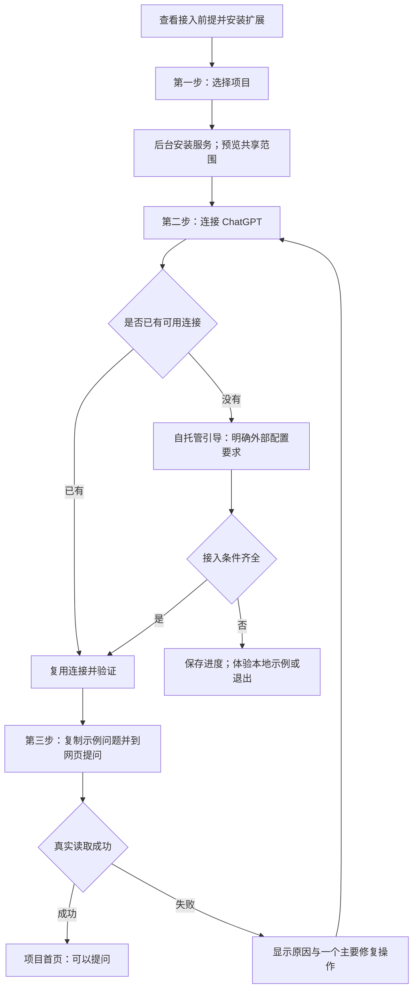
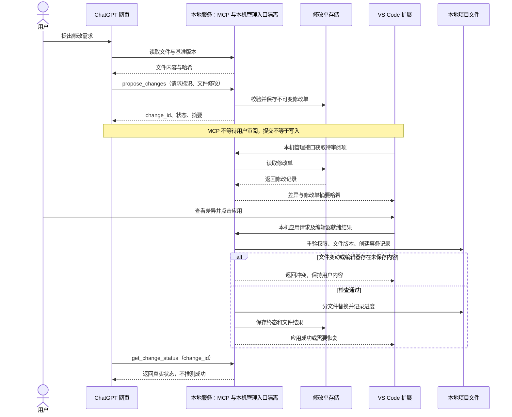
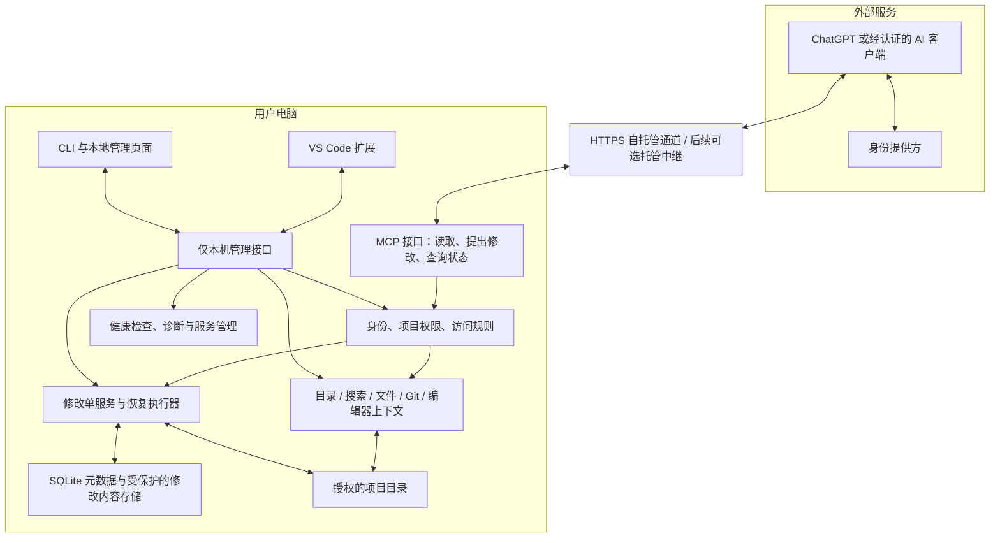
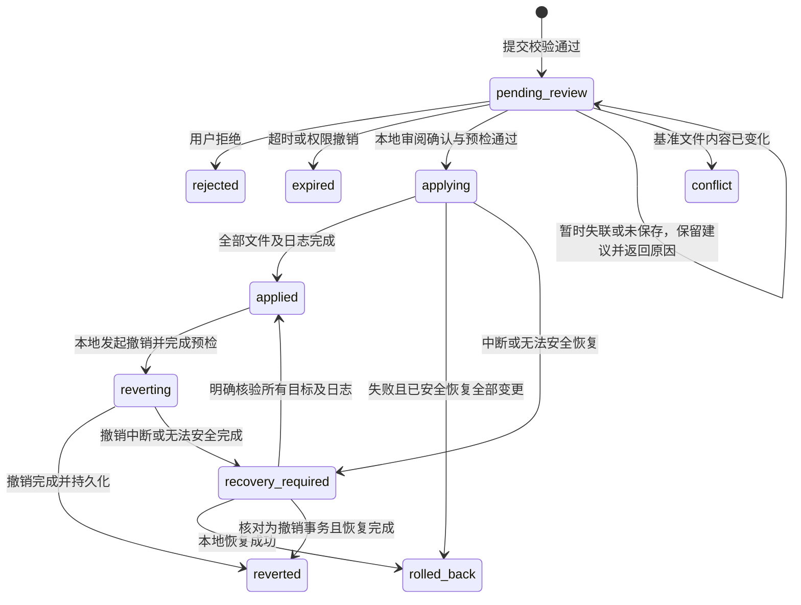

# AI Zhagan 开源产品说明与设计

状态：R2 待用户确认的设计稿，不代表功能已经实现。  
日期：2026-09-21。  
配套文档：[实施计划](../plans/2026-09-21-ai-zhagan-product-plan.md)。

## 评审摘要：本轮为什么调整

**用户角度：上一版可完成任务，但还不能称为足够容易上手。系统角度：已有可靠性原则，但一些关键风险验证偏晚，接口和运行维护规则还不够具体。**

| 原设计不足 | R2 优化 | 验收依据 |
|---|---|---|
| 四个并列区域、六个设置步骤，用户需要自己拼出工作流 | 一个项目首页、三个用户步骤，技术检查后台完成 | 首次使用观察、步骤完成率、求助次数 |
| 自托管前提可能到安装后才暴露 | 下载页与向导入口先说明；缺少条件时可试用本地示例 | 不具备域名／账号条件的人能理解当前限制与下一步 |
| 操作状态和技术状态混杂 | 首页用“可以提问／待查看修改／需要处理”，诊断页展开四层状态 | 用户能说清是否已经改了磁盘 |
| 权限、上下文范围容易误解 | 两种用户模式、文件范围预览、明确已保存／未保存来源 | 能辨认只读与待确认修改，能看到实际分享范围 |
| 编辑器暂时失联也要重新生成修改，恢复成本高 | 暂时性阻塞保留修改单；只有基准内容变化才重新生成 | 不变的修改单可在恢复连接后继续审阅 |
| 写入竞争和打包问题后期才验证 | 增加实施起点 T00 风险验证，并设置是否开放写入的门槛 | 先有真实 Windows 与编辑器证据，再扩大实现 |
| 运行日志、协议、存储和升级规则较分散 | 单一契约来源、模块依赖约束、资源预算、存储恢复及回退规则 | 契约测试、结构检查、故障注入和升级演练 |

本轮保持原有版本范围，不新增独立桌面应用、向量检索、任意命令执行或托管平台实现。最主要的外部门槛仍是自托管接入，不能靠界面简化宣称已经消失。

## 1. 产品定位

**AI Zhagan 让用户在 AI 网页里理解和修改本地项目，并在 VS Code 中查看、应用和追踪修改。**

用户保留熟悉的 ChatGPT 对话入口，AI Zhagan 负责项目访问、编辑器上下文、修改交付和连接诊断。模型由用户选择的 AI 服务提供，核心工具不内置模型推理，也不把网页订阅转换成模型 API。

首版目标用户：个人开发者。首版支持范围建议为 Windows 11 x64、VS Code Stable、本地文件夹、ChatGPT 网页；开发源码保持 Python 3.11+。其他环境列为未认证，不自动宣称支持。WSL、Remote SSH、Dev Containers、多用户团队服务和多设备写入不在首版范围。

上述范围是本稿建议，尚未视为用户已确认。Claude 与其他 IDE 保留适配接口，完成各自真实验收后再列入支持表。

### 用户获得的价值

- 不必反复复制源码：模型按任务读取相关目录、文件、差异和已发布的编辑上下文。
- 不必手动搬运修改：网页提交修改单，在 VS Code 查看差异并应用。
- 明确实际发生了什么：已读文件、写入结果、版本冲突、连接失败均可查询。
- 自托管能力完整：公开源码和可复现构建；托管连接即使后续提供，也不是核心功能的强制依赖。

### 对外描述边界

不承诺“无限上下文”“读取所有文件”“永不消耗 Codex 额度”“所有账号零配置可用”。读取受授权、文件类型、大小和扫描预算约束；AI 侧费用与额度由实际入口及供应商规则决定。

文件仍以本地为主副本，但工具返回的内容会发送给对应 AI 服务。若经过托管中继，需披露其数据处理边界，不能称为“源码不离开电脑”。

## 2. 现状与差距

本次依据工作区源码检查，不把历史测试报告当作本次复测结果。

| 项目 | 当前证据 | 产品化所需调整 |
|---|---|---|
| 项目读取 | `src/project_mcp/server.py` 注册 9 个只读工具 | 保留兼容接口，补齐错误码、范围与分页说明 |
| 文件保护 | `workspace.py` 有路径校验、排除规则、大小与扫描限制 | 增加用户可理解的访问范围预览；规则不能只靠文件名识别秘密 |
| 编辑上下文 | VS Code 发布未保存内容、选区、诊断，快照有期限 | 显示新鲜度；写入前必须重新询问编辑器状态 |
| 连接安装 | PowerShell 脚本、手动令牌、域名及 OAuth 配置 | 扩展管理运行包、向导及分层诊断 |
| 写入 | 无修改工具 | 新增持久化修改单与本地应用流程 |
| 授权状态 | `/api/status` 中 `cloud_account_verified` 固定为 false | 改成有时间和证据的真实状态，不能用配置存在代替验证 |
| 网页读取 | 本次沟通已获得 `qed` 实际目录和 README 内容 | 补充可重复验收记录；不能推断长期稳定或所有账号兼容 |
| 测试 | 有 Python、管理页面和 Extension Host 测试 | 增加真实组合链路、故障注入、干净机器安装 |
| 可移植性 | 扩展集成测试写死本机 VS Code 路径 | 自动发现或测试参数指定 |
| 开源准备 | 扩展为 `UNLICENSED`，许可文件限制再分发 | 确定开源许可证并同步包元数据、第三方声明 |
| 仓库管理 | 本次检查当前目录未识别为 Git 仓库 | 实施启动时确认仓库位置，再建立可追踪基线 |

## 3. 产品形态与优化选择

### 推荐形态

**VS Code 扩展为主要入口，独立本地服务为核心，本地管理页面与 CLI 为辅助入口。**

| 选择 | 取舍 |
|---|---|
| VS Code 扩展 + 本地服务 | 复用现有实现；直接使用编辑器差异视图、状态栏和工作区；首版推荐 |
| 独立桌面应用 + 多 IDE 插件 | 更通用，但多一套安装、升级和界面维护；后续按需求增加 |
| 仅 CLI | 保留给自托管和开发人员，不作为普通用户的唯一入口 |

### 相比上一轮讨论的调整

1. **连接难度单独解决。** 自托管 Beta 允许用户配置域名及 OAuth；“免配域名”需要另一项托管连接工程，不包装为现有能力。
2. **修改单异步处理。** MCP 提交后立即返回编号，用户审阅不限于一次 HTTP 请求的生命周期。
3. **首版由本地执行应用。** 远程只能提交和查询修改；具体写入由 VS Code 中一次本地操作触发，降低误触和确认来源不明的问题。
4. **首版创建、修改 UTF-8 文本。** 删除、重命名、二进制编辑、自动运行命令独立排期。
5. **按任务检索。** 提供目录概览、搜索、批量小范围读取，不把每轮上传整个仓库作为主要工作方式。
6. **保留现有 Python 服务。** 不为产品化重新选整套技术栈；重点改进交付、协议和故障恢复。

## 4. 首次使用流程：用户只做三个决定

对用户显示三步：**选择项目 → 连接 ChatGPT → 试着问一个问题**。运行包下载、本机配对、端口检查作为步骤内进度显示，不要求用户分别配置。

下载页先列出操作系统与账号条件，并明确“首次自托管连接需要 HTTPS 入口与授权配置”。已有连接自动复用；没有接入条件时，可选择使用扩展附带的示例项目体验本地读取和差异预览，示例必须标记“演示数据，尚未连接 ChatGPT”。不自动把真实项目拿来演示。

首次进入即检查账号接入前提，避免用户安装完才发现没有相应连接能力。外部网站授权由用户在浏览器完成；不托管 ChatGPT 密码、Cookie，不依赖网页 DOM 自动点击。

用户只需要理解“当前项目、可以做什么、下一步”。端口、令牌、隧道和协议版本放在设置或故障详情中。尚未提供的托管连接不作为可点击选项出现在首版向导。

本机配对建议采用同一操作系统用户下的受限 IPC 或一次性引导凭据，扩展将长期凭据存入 SecretStorage；禁止开放匿名配对端点或把凭据放进 URL、日志和共享工作区配置。

自托管向导必须保存完成进度，能继续上次配置；权限撤销后立即阻止新的读取、提交和应用。已返回给 AI 的内容无法撤回，运行中操作的停止规则见第 9 节。

### 4.1 默认值与权限表达

| 用户可见设置 | 默认与解释 |
|---|---|
| “仅查看代码” | 默认模式，可以读取共享范围内的文件，不能提交修改 |
| “允许提出修改” | 可生成待审阅修改；提示“仍需你在 VS Code 中点击应用” |
| “共享范围” | 当前选择的文件夹，预览规则和示例路径；排除密钥、状态目录和依赖产物 |
| “包含未保存内容” | 默认关闭，首次主动发布时解释数据内容与有效期；自动同步单独启用 |
| “暂停共享” | 阻止新远程访问，保留配置与修改历史，恢复不需要重装 |

每个项目只需首次确认访问范围；不会为每次正常读取增加本地确认。增加授权目录或启用修改能力时再确认。多根工作区、同名项目和多个编辑器会话必须明确选择，不自动切换到其他项目。

### 4.2 日常最短操作路径

- 再次打开项目：显示项目名和状态；配置有效时直接点“去 ChatGPT 提问”。
- 获取上下文：点“复制提问模板”，模板包含明确的项目标识、当前相对文件路径和可选会话标识，不含令牌或源码；用户在网页自行发送。
- 修改代码：网页提出需求，VS Code 显示一条“3 个文件待查看”，查看差异后一次点击“应用这次修改”。
- 返回网页：提供“复制结果查询提示”，内容包含对应修改编号；不假设网页会自动继续对话。

首版不声称能自动打开某个 ChatGPT 对话或自动填入问题。用户主动操作的默认闭环只跨网页与 VS Code，不要求日常另开管理页面。

## 5. 日常读取与修改流程

### 5.1 理解项目

文件读取保留路径、行号、磁盘版本哈希和来源。编辑器快照显示会话、文档版本和发布时间，过期时明确返回错误，不能静默用另一窗口替代。

分页必须区分“仍有下一页”和“扫描预算已耗尽”。超大目录提示缩小子目录，不让模型反复增加 offset 却永远读不到后续文件。新增批量读取建议最多 10 个文件，复用单文件限制并限制总响应体。

### 5.2 网页提出修改、本地应用

ChatGPT 不一定会在本地操作后主动继续对话。用户可以在网页追问“查询这次修改结果”，或由下一次工具调用获取终态。首版不承诺跨界面自动唤醒。

网页所在平台可能还要求对工具调用进行确认。它与本地应用授权是不同环节，不能承诺消除平台强制确认。

## 6. 核心功能与界面

采用一个首页和两个辅助入口，避免把底层模块直接变成四个平级导航。用户界面说“修改建议”，内部协议继续使用修改单和 `change_id`。

| 区域 | 用户操作 | 必须显示的信息 |
|---|---|---|
| 项目首页 | 选择项目、去提问、查看修改、暂停共享 | 当前项目、用户模式、共享范围摘要、一个主要下一步 |
| 待处理修改 | 预览、应用、拒绝、查询恢复、撤销 | 文件差异、内容新鲜度、修改结果、能否撤销 |
| 设置与诊断 | 管理连接、修改范围、重新授权、查看活动 | 展开四层连接状态、版本、最近调用证据、日志和诊断导出 |

状态栏示例：`AI Zhagan · qed · 可以提问 · 2 项待查看`。历史调用成功只表示上次验证成功；“可以提问”还要求当前服务、通道及授权检查未失败，详情显示验证时间。

| 当前情形 | 用户文案 | 主要操作 |
|---|---|---|
| 未配置 | “选择要共享的项目” | 添加当前项目 |
| 可读取 | “可以向 ChatGPT 提问” | 去提问 |
| 提交成功 | “修改建议已收到，本地文件尚未改变” | 查看修改 |
| 已应用 | “已更新 3 个文件，尚未运行测试” | 查看结果 |
| 暂时阻塞 | “请先保存此文件，再重试检查” | 打开该文件 |
| 版本冲突 | “文件在生成建议后已变化” | 复制重新生成提示 |
| 部分完成／状态不明 | “需要恢复，已暂停此项目的自动应用” | 查看恢复方案 |

界面必须支持键盘操作、焦点顺序、屏幕阅读器标签和 VS Code 明暗主题；状态不能仅通过颜色表达。日常成功读取不弹通知，修改到达按批次提醒，重复错误合并；需要用户操作的错误才持续展示。

失败提示示例：

- “本地服务正常，远程通道已断开。正在重连。”
- “README.md 已在编辑器中修改，请保存后重新生成修改单。”
- “修改已应用，网页确认响应未送达；可按修改编号查询结果。”

首版按整份修改单应用或拒绝，不提供可能破坏跨文件依赖的逐行勾选。用户希望调整部分内容时重新生成修改单。默认外部浏览器打开助手，集成浏览器作为可选入口。

## 7. 技术架构

远程通道仅转发 MCP 服务，不能转发本机管理接口。远程调用者无本机应用、批准、恢复和管理凭据。

本地服务保持 IDE 独立，但首版写入要求 VS Code 审阅会话在线。独立管理页首版提供只读修改状态，不另做一套文件写入引擎。

不引入向量数据库、云端源码仓库或模型网关。SQLite 用于修改状态、去重和恢复日志；源码内容不进入普通活动日志。备份与待应用内容需要同用户文件权限和加密存储，密钥由操作系统凭据机制保护。

### 7.1 可维护性约束

1. **单进程模块化服务。** MCP、管理接口为薄适配层，调用同一应用服务。领域模块不依赖 VS Code、HTTP 或 FastMCP；不拆微服务、不引入消息队列平台。
2. **一种文件写入实现。** CLI、管理页面和扩展不得各自增加直接写入路径；首版应用由本机管理接口调用统一执行器。
3. **单一契约来源。** Python 验证模型定义字段、错误码和状态，导出版本化 JSON Schema；扩展使用生成的校验器／夹具验证，不手抄另一套状态枚举。
4. **状态有修订号。** 每次合法状态转换增加 `revision`，服务端以预期状态和修订号条件更新；客户端不能让旧响应覆盖新状态。
5. **依赖方向可检查。** `server/admin → application services → domain/storage/filesystem adapters`；契约、时钟和文件操作可注入测试。核心测试不需真实账号、公网或 IDE。
6. **控制维护面。** 扩展是唯一完整交互界面，本地页面只保留诊断与必要管理；首版使用有界轮询更新修改列表，暂不同时维护轮询与事件流两套机制。
7. **可理解的贡献路径。** 常见功能有对应模块、测试夹具和维护者；接口变更、状态迁移和存储迁移分别留下决策记录与兼容测试。

## 8. 修改协议与可靠性边界

### 8.1 新增工具

| 接口 | 权限 | 作用 |
|---|---|---|
| `propose_changes(project_id, request_id, summary, files)` | 远程、项目允许提交修改 | 保存修改单，返回 `change_id`；具有状态变更，不标记为只读 |
| `get_change_status(project_id, change_id)` | 远程、按项目和身份检查 | 查询状态、错误码、文件应用结果 |
| `get_change_diff(project_id, change_id)` | 远程、按读取策略过滤 | 返回有界差异；敏感路径同样受保护 |
| 本机 `/api/changes/{id}/apply` | 本机授权 + 有效编辑器审阅租约 | 应用用户审阅的确切内容 |
| 本机拒绝／撤销／恢复接口 | 本机授权 | 生命周期管理；均校验当前权限和状态 |

`files` 每项包含相对路径、`create` 或 `modify`、基准原始字节 SHA-256、预期 UTF-8 文本内容。创建时基准哈希必须为空，目标必须不存在。CRLF、BOM 和最终换行变化在差异中可见，服务不隐式重写内容。

首版每份修改单最多 20 个文件；单文件最终内容不超过 1 MiB；整个提交 JSON 请求体不超过 2 MiB，任一限制先达到即拒绝。超过限制需按独立可验证的任务拆分。

`request_id` 是用户身份与项目范围内的幂等键。同键同内容返回原修改单；同键不同内容返回 `IDEMPOTENCY_CONFLICT`。修改单一经提交不可原地编辑，更改内容须新建单据并重新审阅。

默认项目只读；用户启用“允许提出修改”后才能提交。它不授予远程直接写入权限。OAuth 的身份认证与项目能力授权分别验证，不能把 GitHub `read:user` 当成项目写权限。

### 8.2 状态机

暂时失联、未保存内容、租约过期属于可重试阻塞，保留 `pending_review` 并返回阻塞原因；在文件基准未变时可重试预检，无须重做整个需求。`conflict` 专指基准内容改变，需要重新读取并新建修改单。恢复状态禁止同项目继续写入，直到本地处理完成；读取仍可用，但返回恢复提示。

持久化记录包含 `transaction_kind`（apply 或 revert）；恢复终态由事务类型与逐文件证据确定。恢复不能因为磁盘恰好与预期相同就随意标记其他修改成功。撤销预检失败时仍保持 `applied` 并返回冲突，不产生虚假的已撤销状态。

待审阅修改单默认 24 小时过期，修改内容和恢复备份默认保留 7 天，可在本地调整。未解决的恢复项不能自动清理。幂等终态摘要默认保留 30 天，超期查询明确返回记录已过保留期，不能推测执行状态。

界面显示“可撤销至某时间”；备份被清理后禁用撤销并说明原因。应用、拒绝、撤销、恢复也必须幂等：同一操作超时后查询原操作编号，不自动创建新的操作。不存在或已清理的编号统一返回 `RECORD_UNAVAILABLE`，不能据此断言从未执行；客户端不得自动重放。去重保证覆盖 30 天保留期，不承诺删除记录后仍可无限期识别旧请求。

### 8.3 写入与恢复原则

- 项目内串行应用；应用时再次校验项目授权、规范化路径、符号链接／junction、文件类型和基准哈希。
- 同单据规范化后重复路径、Windows 大小写别名和硬链接目标拒绝写入；文件替换需验证权限及必要元数据未意外放宽。
- 所有已登记的相关编辑器会话参与就绪检查。会话过期、失联或有未保存内容时阻止应用，不使用 15 分钟上下文快照推断当前安全性。
- 创建文件采用“不覆盖已有目标”的方式；替换文件先写同目录临时文件，再使用平台支持的替换操作。
- 修改前保存可恢复的原始字节，写前日志持久化后才能开始修改；每个文件记录前后哈希和完成进度。
- 多文件替换不是跨文件系统原子事务。发生中断必须有明确恢复状态；不可宣称所有文件永远同时成功或同时失败。
- 服务启动发现未完成事务时，先核对磁盘内容，再进入恢复流程；不盲目继续写入。
- 撤销与回滚只处理属于该修改单且当前哈希符合预期的文件；有后续修改则停止并报告冲突。
- 哈希检查和项目锁不能完全排除未参与协议的外部进程并发写入。首版支持边界是受管理的本地工作区；对 VS Code 编辑竞争必须做集成故障测试，发布前若仍有无法控制的窗口则不开放写功能。

### 8.4 存储与一致性补强

- SQLite 状态、加密内容、项目文件是三个不同持久化对象，不假设一次数据库事务能让它们一起原子提交。
- 内容先写临时 blob 并完成完整性验证，再登记数据库引用；事务开始前确认备份与恢复日志可读，存储不足时不开始写项目。
- `pending_review`、`applying`、`reverting`、`recovery_required` 引用的内容不能被保留期清理；终态备份从实际完成时间起计时，清理先解除引用再删除无引用 blob。
- 数据库使用单写者、有界忙等待与可验证的持久化策略；备份使用数据库支持的快照方式，同时保存被引用 blob 和密钥可用性检查，不直接复制正在写入的数据库文件。
- 数据库损坏或密钥不可用时停止修改功能，给出恢复原数据、导出可读日志等选项；不删除存储或创建空库来伪装修复。现有有效授权仍可读取，但修改提交和应用均暂停。
- 启动恢复依据事务日志与文件证据；失效租约、程序崩溃、内容清理和服务重启都不能让一次应用执行两遍。

**提前验证门槛：** 在正式扩展写入界面前，用真实 Windows + VS Code 对“预检后再次编辑”“替换中断”“撤销中断”建立可复现测试。若无法满足受支持环境内的保护要求，继续发布只读／生成补丁能力，明确暂停自动应用，不以反复缩小验收口径通过发布。

## 9. 连接、安装与运行维护

### 9.1 接入版本

| 接入方式 | 发布定位 | 承诺 |
|---|---|---|
| 自托管 HTTPS + OAuth | 首批公开 Beta | 向导、诊断和文档齐全，仍有外部配置前提 |
| 支持的供应商隧道 | 后续可选适配 | 先验证账号、权限和凭据前提，再加入连接选项 |
| 项目方托管中继 | 独立后续工程 | 设备配对、隔离、限流、重连和可观测；不能假设免费运营 |

供应商接入规则可能变化。当前 OpenAI 官方文档列出公共 HTTPS 或 Secure MCP Tunnel 两条路径；后者需相应配置和权限，不等于所有普通用户免配置。公共插件分发有独立要求。见文末来源。

### 9.2 生命周期

服务运行包按版本和架构交付，下载须校验来源及校验和；不能从项目文件声明的任意 URL 下载执行程序。服务单实例、受控重启、日志轮转，端口冲突不终止其他进程。

单实例范围是同一操作系统用户和受管理配置。发现既有手动部署服务时让用户明确选择复用或新建隔离配置，不接管和停止不属于扩展管理的进程；只有所有者才能升级或停止该服务。

重连采用有上限的指数退避与抖动；用户点击暂停后停止自动重连。扩展停用、项目移除和授权撤销须终止新操作。更新只在没有写入或恢复事务时执行；保留上一版本，配置迁移失败则恢复旧配置。

扩展和服务通过 `api_version`、`capabilities` 协商功能；不兼容时阻止写入并给出升级路径。已有只读客户端在兼容窗口内继续工作。

### 9.3 资源预算、重试与降级

| 机制 | 首版默认策略 |
|---|---|
| 读取调度 | 最多 4 个并发读取、32 个排队请求；超限返回可解释的忙碌结果 |
| 写入调度 | 首版服务内最多 1 个文件修改事务；按项目保留锁和恢复隔离，其他项目读取可继续 |
| 数据配额 | 最多 100 份待审阅修改、受保护内容与备份默认 1 GiB；达到上限拒绝新提交，不删除恢复所需数据 |
| 空间不足 | 开始事务前预估备份与目标临时文件空间；中途磁盘不足按恢复流程处理 |
| 扩展轮询 | 待处理页面可见时每 3 秒查询；隐藏时每 30 秒；每次最多一个请求，携带修订号 |
| 连接重试 | 1、2、4、8、16、30 秒上限并加入抖动；连续 5 次失败后显示主要修复操作，以不快于 30 秒的频率检查 |
| 禁止盲重试 | 认证失效、权限不足和版本冲突等待用户处理；写入超时先查状态，不重新提交新应用 |
| 熔断恢复 | 自身服务 5 分钟内异常退出 3 次则停止自动拉起，显示诊断；普通网络断连不重启本地服务 |

这些预算属于可测试的首版默认值，由本机设置调整，远程请求不能扩大。健康检查和修改状态查询有独立的小额调度预算，避免大目录搜索堵住诊断与恢复；具体实现仍在一个服务中。

暂停共享或撤销授权时取消未开始操作，尽力取消读取，但不能撤回已返回数据。正在修改的单文件操作先落定并记日志，再停止后续文件；若整单尚未完成则进入 `recovery_required`。本机用户可显式恢复，不能通过中断进程实现“暂停”。

一个窗口关闭不能终止其他窗口正在使用的服务；没有窗口时可保持只读服务运行，新的本机应用必须有在线审阅会话。失联编辑会话显示具体窗口和处理方式，不能悄悄忽略仍可能有未保存内容的窗口。

### 9.4 升级与兼容维护

API 主版本不同则禁用不兼容功能，次版本只增加可选字段。发布时测试当前及前一稳定的扩展／服务组合；旧工具名称和字段不能在补丁版本中删除。

升级前暂停新修改，完成事务并生成配置、数据库、blob 引用和密钥检查记录的一致快照；同时保留上一运行包。新版本未验收前不接受新修改。回退仅恢复成对的数据与程序，不让旧二进制直接打开新数据库结构；已在新版本发生业务写入后优先修复，不能直接回退旧快照丢掉新记录。

为保证可维护性，CI 在第一个基线任务启用，每次 PR 执行契约和针对性测试，里程碑执行真实组合回归。发布说明记录支持矩阵和迁移限制，不承诺尚未验证的兼容组合。

## 10. 可验收的质量目标

以下为建议发布门槛，不是已测得结果。性能测试固定 Windows 11 x64、4 核、16 GiB 内存、SSD、10,000 个小型 UTF-8 文件；报告必须记录实际环境、样本量和缓存状态。

| 维度 | 目标与测量方法 |
|---|---|
| 安装 | 无 Python／Node 的干净 Windows 环境，连续 3 次安装、启动、卸载成功 |
| 上手 | v0.2 前先观察 3 名新用户，v1.0 前至少 5 名；具备接入前提者至少 4/5 在 10 分钟内独立完成真实读取，分别报告外部准备与实际操作总时长 |
| 不具备接入条件 | 至少 3 名用户能在 2 分钟内识别缺失条件并完成演示或找到配置入口，不误以为网页已经连接 |
| 二次使用 | 已完成有效配置的用户，重启 VS Code 后无需重复授权即可找到“去提问”；失效授权必须有明确重新授权入口 |
| 语义清晰 | 试用者能区分“已收到建议”“已应用”“未运行测试”；应用前知道目标项目与文件数量 |
| 操作负担 | 本地日常读取零新增确认；查看差异后一次明确应用；平台强制确认单独记录，不算作可消除步骤 |
| 本地读取 | 100 KiB 文件读取 100 次，本地工具处理耗时 P95 ≤ 500 ms；不含网络和模型耗时 |
| 有界检索 | 扫描预算耗尽后及时返回原因；受控测试中本地请求不超过 5 秒 |
| 网络恢复 | 故障模拟中网络恢复后 30 秒内恢复可用，连续 20 次断连循环通过；不对外部供应商故障作恢复承诺 |
| 重复调用 | 同一修改请求重试 100 次，只产生一份修改单和一次有效应用 |
| 中断恢复 | 每个写入阶段故障注入，均能确定实际状态；不能丢失原始恢复数据或覆盖新修改 |
| 编辑器冲突 | 未保存内容、两个窗口、预览后再编辑三个场景均阻止不适当应用 |
| 长时间运行 | 24 小时混合读写、断连测试无未处理崩溃；固定负载下无持续内存增长，附采样记录 |
| 平台兼容 | 当前 Stable 与前一 Stable 的 VS Code，通过真实 Extension Host 测试后才标记支持 |
| 降级隔离 | 通道断开不破坏本地历史；内容存储故障禁用修改但不伪装整个服务离线；读取拥塞时诊断仍响应 |
| 升级恢复 | 配置、数据库、内容与程序成套升级回退；不丢失已确认应用记录 |
| 维护成本 | 新贡献者按文档在无公网账号环境运行核心测试；协议生成结果无漂移，领域层不反向依赖 UI／MCP |

历史覆盖率只作为回归信号；写入和恢复路径必须有行为测试、失败注入和真实安装验收。

## 11. 开源交付与版本范围

建议采用 MIT 许可证，最终由权利人确认后再替换现有限制性许可。统一源码、扩展、安装包许可信息，核查依赖和分发运行时的声明要求。本稿不改变现有许可证。

| 版本 | 核心交付 | 不包含 |
|---|---|---|
| v0.2 只读公开 Beta | 开源基础、运行包、向导、访问范围、真实连接状态、诊断 | 自动写入、托管中继 |
| v0.3 修改公开 Beta | 修改单、VS Code 审阅、应用、冲突、恢复、撤销 | 删除／重命名、任意命令执行 |
| v1.0 自托管稳定版 | 安装与升级稳定、故障验收、兼容矩阵、完整教程 | 未经过验收的平台能力 |
| 独立扩展阶段 | 托管连接、macOS／Linux、Claude 等适配 | 不与首版完成条件绑定 |

仓库包含中英文 README、3 分钟演示、快速开始、架构说明、贡献指南、行为准则、安全问题报告入口、Issue／PR 模板、变更记录、兼容矩阵、发布工作流及校验和。基础贡献流程不需要维护者的账号、密钥或公网域名。

默认不上传遥测；可用性测试和诊断由用户主动参与。发布前检查打包白名单，排除 `.local`、真实项目配置、OAuth 数据、日志、测试缓存和个人信息。

## 12. 本次需要确认的决策

1. 首版范围采用个人开发者、Windows 11 x64、VS Code、ChatGPT 网页。
2. 先交付自托管 Beta；免配域名的托管连接独立立项。
3. 写入采用“网页提交修改单，VS Code 本地审阅后应用”；不开放远程直接覆盖。
4. 首版只创建／修改 UTF-8 文本，测试命令由用户运行。
5. 开源许可证建议 MIT，确认权利归属后统一替换。
6. 采用 R2 三步上手、单项目首页和风险先验；写入实验不通过则保持只读／补丁交付，托管便捷接入继续独立评审。

确认以上范围后按配套计划实施。R2 评审阶段仅更新两份文档，不修改运行中服务、授权配置和产品源码。

## 13. 参考依据

- 本地实现：`src/project_mcp/server.py`、`workspace.py`、`admin.py`、`auth.py`、`cli.py`。
- 扩展实现：`extensions/vscode/extension.js`、`package.json`、`integration/run.js`、`LICENSE.txt`。
- 既有验收记录：`docs/self-test-report.md`；本文不宣称重新执行其中的测试。
- [OpenAI：连接和测试插件](https://developers.openai.com/plugins/deploy/connect-chatgpt)，本次沟通已核对，包含连接、账号前提、真实工具调用与写入确认验收。
- [OpenAI：Secure MCP Tunnel](https://developers.openai.com/api/docs/guides/secure-mcp-tunnels)，本次沟通已核对，包含私有连接、凭据前提与公共分发边界。
